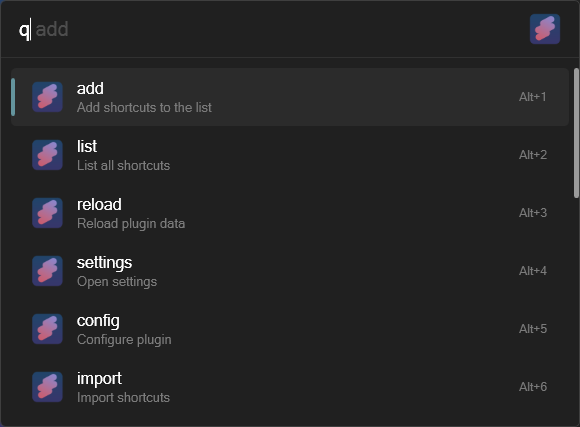
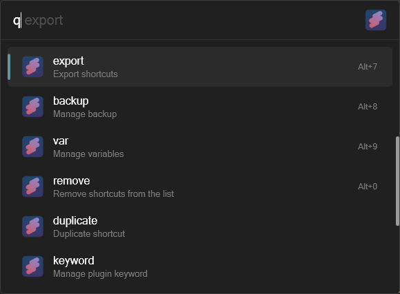
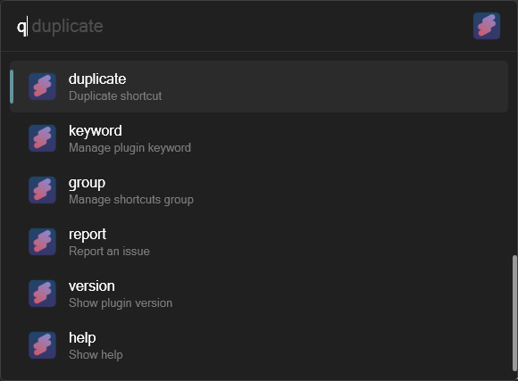

    
  <h1>Shortcuts Plugin   Quickly launch your shortcuts</h1>
   

   

      
      
      
      
   

> **Warning**
> This is a work-in-progress and not the finished product.
>
> Feel free to leave suggestions or report bugs in
> the [issues](https://github.com/mantasjasikenas/flow-launcher-shortcuts-plugin/issues) section.

# Table of contents

- [Features](#features)
- [Commands](#commands)
- [Screenshots](#screnshots)
- [Licence](#licence)

# Features

- Directories, files and urls shortcuts support. More types coming soon.
- System and user defined variables support
- Import and export shortcuts
- Duplicate shortcuts
- Open shortcuts configuration or helpers file
- Show list of commands
- Show or set plugin keyword

# Commands

## Open shortcut

`q <shortcut_name>` - opens shortcut with name `shortcut_name`

## Show available commands

`q help` - shows list of commands

## Add new shortcut

`q add <shortcut_name> <shortcut_arguments> [shortcut_type]`

- `shortcut_name` - name of the shortcut
- `shortcut_arguments` - arguments of the shortcut
- `shortcut_type` - type of the shortcut (optional). Supported types: `directory`, `file`, `url`

### Examples

- `q add my_shortcut C:\Users\my_user\Documents directory` - adds a shortcut to the `Documents` folder
- `q add my_shortcut "C:\Users\my_user\Documents"` - adds a shortcut to the `Documents` folder
- `q add my_shortcut https://www.google.com url` - adds a shortcut to the `https://www.google.com` url

Note: if shortcut type is not specified, it will be automatically detected based on the shortcut arguments.

Shortcut arguments can contain variables, e.g. `%appdata%` or user defined variables. For example, to add a shortcut
to the `AppData` folder, use the following command: `q add [your__shortcut_name] %appdata%`. To use your defined
variables, use the following syntax `${variable_name}`. For example, to add a shortcut to the `AppData` folder, use
the following command: `q add [your__shortcut_name] ${appdata}`.

## Show or set variable

`q var [variable_name] [variable_value]`

- `variable_name` - name of the variable (optional)
- `variable_value` - value of the variable (optional)
- Note: if optional arguments are not specified, all variables will be shown

### Examples

- `q var` - shows all variables
- `q var appdata` - shows value of the `appdata` variable
- `q var appdata C:\Users\my_user\AppData\Roaming` - sets value of the `appdata` variable
  to `C:\Users\my_user\AppData\Roaming`

- Note: variables can be used in shortcut arguments using the following syntax: `${variable_name}` for user defined
  variables and `%variable_name%` for system variables.

## Remove shortcut

`q remove <shortcut_name>`

- `shortcut_name` - name of the shortcut

### Examples

- `q remove my_shortcut` - removes shortcut with name `my_shortcut`

## Show path to shortcut

`q path <shortcut_name>`

- `shortcut_name` - name of the shortcut

### Examples

- `q path my_shortcut` - shows path to shortcut with name `my_shortcut`

## Show or set plugin keyword

`q keyword [keyword]`

- `keyword` - keyword of the plugin (optional)

### Examples

- `q keyword` - shows current keyword of the plugin
- `q keyword vb` - sets keyword of the plugin to `vb`

## Duplicate shortcut

`q duplicate <shortcut_name> <new_shortcut_name>`

- `shortcut_name` - name of the shortcut
- `new_shortcut_name` - name of the new shortcut

### Examples

- `q duplicate my_shortcut my_shortcut_copy` - duplicates shortcut with name `my_shortcut` to `my_shortcut_copy`

## Open shortcuts configuration or helpers file

- `q config` - opens shortcuts configuration file
- `q helpers` - opens helpers file

## Show list of commands

- `q help` - shows list of commands

## Import or export shortcuts

- `q import` - imports shortcuts from a file
- `q export` - exports shortcuts to a file

## Screnshots

 
 

 
 

# Licence

The source code for this plugin is licensed under MIT.